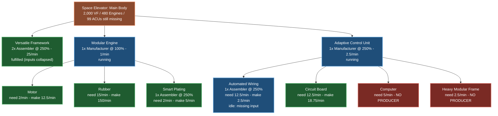

# Space Elevator: Main Body — Configured Production Lines

> Historical design snapshot (2026-07-20). This example established the distilled-path UX, but its
> rates and aggregate status colours predate the solved flow graph, fluid modeling, and transport
> edges. It is not current validation evidence. See [AnalysisModel.md](AnalysisModel.md),
> [FlowModel.md](FlowModel.md), and [Validation.md](Validation.md) for the current contracts.

Snapshot of the live save at that time (standard recipes throughout, clocks as configured).
Node colors: **blue** = a machine produces it but supply < demand, **green** = fully supplied
(supply ≥ demand), **red** = no producer configured.

## Reading the board

| Status | Parts | Action |
|---|---|---|
| 🔴 No producer | Computer, Heavy Modular Frame | Build lines. The ACU Manufacturer is draining the 123-Computer stockpile at 5/min (~25 min of runway). |
| 🔵 Under-supplied | Automated Wiring (2.5 vs 12.5/min) | AW needs ~5x capacity (its own Assembler idles on missing Stator/Cable input). |
| 🟢 Covered | Versatile Framework (chain collapsed), Motor, Rubber, Smart Plating, Circuit Board | VF and the whole Modular Engine chain are healthy. |

Data sources: prototype snapshot tooling (recipe edges, configured capacities/clocks, storage
totals) cross-checked against a live configured-production scan. Circuit Board margin assumes no
other consumers come online; a Computer line would add 12.5+/min of new Circuit Board demand.
